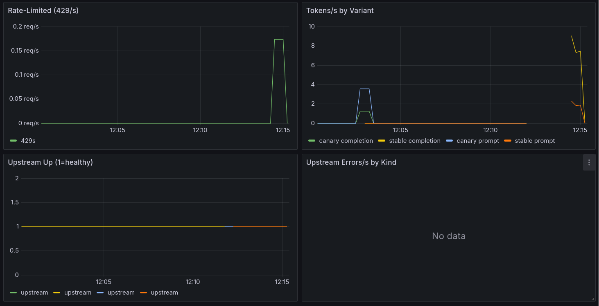

# DomainBot — Production LLMOps Platform

A complete, self-hosted lifecycle for a fine-tuned LLM: **curate data → fine-tune → gate → serve → deploy → observe → retrain**. Everything runs behind a thin FastAPI gateway on Kubernetes, ships through GitOps CI/CD, and is guarded by an evaluation gate that can block a bad model from ever reaching production.

Built around a QLoRA fine-tune of `Qwen2.5-1.5B-Instruct`, but the model is incidental — the point is the **infrastructure and the discipline around it**: reproducible data, a blocking quality gate, versioned releases, canary rollouts, caching, observability, retrieval, safety guardrails, and an automated retrain loop.

```
                         ┌──────────────── retrain loop ─────────────────┐
                         │                                               │
  data pipeline → QLoRA fine-tune → evaluation gate → registry (Hub) → deploy (GitOps)
   curate/scrub/split      MLflow      block if fails      vX.Y.Z         Argo CD
                                                                            │
                                                                            ▼
                           ┌─────────────── Kubernetes ───────────────┐
   client ──▶  FastAPI gateway  ──HTTP──▶  external model endpoint (managed vLLM)
               auth · limits · cache · A/B routing · RAG · guardrails
                    │                    ▲
                 Redis                Prometheus ──▶ Grafana + alerts
```

---

## Why this exists

Most LLM demos stop at "it generates text." Production is the other 90%: proving a model is good enough to ship, shipping it without downtime, catching it when it regresses, serving it cheaply, and updating it safely. This project is that 90%, built end to end and small enough to run on a laptop (the gateway) plus a rented GPU (training).
---

## Architecture

**Gateway / engine split.** The model runs on an external, OpenAI-compatible endpoint (managed vLLM); Kubernetes runs only a stateless FastAPI **gateway** that owns everything that is *policy* rather than *inference* — auth, validation, the server-side system prompt, caching, rate limiting, A/B routing, retrieval, guardrails, health, and logging. The engine is swappable (vLLM ↔ llama.cpp) with zero client changes, and the model version is a single config value.

**Why external inference.** GPUs are expensive and spiky; a managed endpoint owns scheduling and scaling. The gateway is CPU-only and autoscales cheaply. This is a common, cost-effective production pattern — and it keeps the gateway image tiny (code only, no weights).

**GitOps everywhere.** Deploys are Git commits. CI builds and pushes the gateway image, writes the new tag into the manifests, and Argo CD syncs the cluster. Rollback is `git revert`. No CI system holds cluster credentials.

---

## The through-line: one real bug, defended in depth

Early on, an over-aggressive PII scrub replaced locations and dates in the training data with placeholders like `<LOCATION>`. The fine-tuned model learned to emit them — answering "the capital of `<LOCATION>` is Tokyo." This one bug (tracked as INC-013) shows up as a design constraint across the whole stack:

1. **Data** — the scrub was corrected to touch only genuinely sensitive PII (email, phone, card, SSN), never locations or dates.
2. **Gate** — the golden set permanently bans placeholder tokens, so any model that regresses is blocked before release.
3. **Serving** — an output guardrail refuses to return a response containing those tokens, even if a future model regressed past the gate.

Three independent layers, so shipping a `<LOCATION>` answer is mechanically impossible. That defense-in-depth mindset — assume any single control can fail — runs through the whole project.

---

## Capabilities

### Data pipeline
Streams [OpenOrca](https://huggingface.co/datasets/Open-Orca/OpenOrca), applies quality filters (refusals, truncation, question-echo, repetition, language, length, dedup), scrubs sensitive PII, converts to chat format, and produces stratified train/val/test splits plus a curation report. Versioned with DVC. Deliberately includes **honesty examples** so the model learns to say "I don't know" — a counterweight to instruction data that always answers.

### Fine-tuning
QLoRA (4-bit NF4 base + LoRA adapters, ~1–3% of params trainable) tracked in MLflow with data-version and git-SHA lineage. Compute dtype is auto-detected (bf16 on Ampere+, fp16 on T4) — hardcoding it is a classic portability crash. Only adapters are saved; merging happens at release.

### Evaluation gate
A **blocking** gate, not a report. It runs a frozen golden set and exits non-zero — halting CI or the retrain pipeline — unless the model clears three conditions: an absolute pass-rate floor, no regression against the currently deployed model, and no per-category collapse (averages hide slice failures). The golden set is never edited to make a model pass; it only grows as production bugs are found. The `must_not_contain` rules make it a standing regression suite.

### Serving
FastAPI gateway with Pydantic validation as the security boundary, a server-side system prompt clients cannot override (a prompt-injection defense), SSE streaming, API-key auth, and proper health semantics — `/healthz` for liveness (process up) versus `/readyz` for readiness (pings the model endpoint; fail = stop routing, don't restart). Errors map cleanly: upstream timeout → 504, endpoint down → 503, endpoint error → 502.

### Kubernetes
Gateway-only deployment with liveness/readiness probes, an HPA (2→10 on load), and a PodDisruptionBudget. If the endpoint goes down, pods go NotReady but aren't restarted — correct handling of an upstream outage rather than a crash loop.

### CI/CD
GitHub Actions runs lint + tests + manifest validation, then builds and pushes `ghcr.io/…/domainbot-gateway:git-<sha>`. **Tests gate the build** — untested code can't ship. Argo CD pulls desired state from Git; `selfHeal` reverts drift, `prune` removes deleted resources. Terraform provisions the namespace and secrets; Helm offers a values-based packaging alternative to Kustomize.

### Caching, rate limiting, A/B routing
A Redis layer in front of the endpoint. The response cache keys on system prompt + messages + params + **model revision**, and only caches deterministic (temperature-0) requests, so a hit is correct by construction — and turns a multi-second upstream call into a ~1ms lookup. A per-client fixed-window rate limiter protects the shared endpoint budget. Canary routing splits a configurable fraction of traffic to a new model version with sticky per-client assignment; ramp 0→100 via one value, roll back instantly to 0. **All three fail open** — if Redis dies, the gateway degrades to "no cache, no limit" and keeps serving.

### Observability
Prometheus scrapes the gateway; Grafana visualizes the four golden signals (latency as a histogram → p50/p95/p99, traffic, errors, saturation) plus cache hit ratio, rate-limit rejections, tokens, and upstream health — every metric labeled by variant so stable and canary are compared directly. Alert rules encode the SLOs (error rate, p95, upstream down, canary error rate → rollback).


The latency panel shows the cache as a **cliff**: requests start at multi-second upstream latency, then drop to near-zero the moment identical prompts start hitting cache. The cache-hit-ratio panel climbs to 100% on repeated prompts — the caching payoff as a live production number, not a one-off benchmark.



Rate-limiting spikes exactly when a client bursts past its quota; tokens are tracked per variant for cost attribution; upstream health holds at 1; the upstream-errors panel reads "no data" — the healthy state.

### Retrieval (RAG)
LangChain + FAISS with OpenAI embeddings ground answers in a knowledge base without retraining. Retrieval separates **knowledge** (documents, edited anytime) from the **model** (retrained rarely) — facts change far more often than weights should. The retriever sits behind a clean interface, so swapping OpenAI embeddings for a local model or a managed vector DB is a one-file change. Embeddings-as-API keeps the image small and mirrors the external-inference pattern.

### Guardrails
The gateway is the trust boundary. An input guard runs *before* the model, blocking prompt-injection and PII we won't forward to a third party (a blocked request never incurs upstream cost). An output guard runs *after* the model, refusing to return banned content. Cheap deterministic rules form the fast first line; a heavier classifier can sit behind them.

### Orchestration
A single pipeline chains retrain → gate → register → deploy → verify, halting at the first failure — the gate is the hard stop, so a bad model cannot reach deploy. It *composes* the real stage entrypoints rather than reimplementing them, so each stays independently runnable. A drift monitor reads the signals already collected (golden pass rate, error/latency, new-data volume, unknown-topic rate) and decides *when* to retrain — urgent on a regression, routine on enough new data. Deploy is a GitOps commit, so every rollout is auditable and revertible.

---

## Quickstart

```bash
make setup                        # deps + hooks
make test                         # full suite (no GPU, no cluster)

# data pipeline (streams OpenOrca; sample mode needs no network)
SOURCE_MODE=sample make data

# serving locally (point the gateway at any OpenAI-compatible endpoint)
make serve

# kubernetes
kubectl apply -k k8s/             # gateway + redis
kubectl apply -k k8s/observability/   # prometheus + grafana

# the retrain pipeline (dry-run plan; the retrain stage runs on GPU infra)
make pipeline-plan
```

Training runs on a GPU box (Colab / Kaggle / RunPod); everything else runs on a laptop.

---

## Testing

The full suite runs without a GPU or a cluster — gate logic, serving, manifests, caching/routing, metrics, RAG/guardrails, and the orchestration pipeline are all unit-tested against fakes.

```bash
make test          # everything
make gate-test     # prove the gate BLOCKS a bad model
make cache-test    # cache + rate-limit + routing logic
make rag-test      # retrieval + input/output guardrails
```

---

## What I'd change at 100× scale

The architecture holds; each component becomes its own managed, scaled service:

- **Inference** on an autoscaling managed GPU fleet (KServe / Ray Serve) with request batching; the gateway stays thin.
- **Retrieval** backed by a persistent vector DB (pgvector / Qdrant / Pinecone), with indexing as an **offline pipeline** that runs on document change — never at pod startup — and an index version folded into the cache key.
- **Orchestration** on a real DAG engine (Argo Workflows / Airflow) for retries, artifact lineage, and parallel eval.
- **Continuous evaluation** — log and sample production traffic, grow the golden set from real failures, and feed the drift monitor real signals instead of fixed thresholds.
- **Progressive delivery** — canary ramps automatically on SLO metrics and auto-rolls-back on breach (Argo Rollouts / Flagger), wiring the canary-error alert to an action rather than a human.
- **Cost as a first-class metric** — token spend and GPU-hours on the dashboard with budgets and alerts.
- **Governance** — per-tenant keys and quotas, retained model cards and eval reports per version, signed images with provenance.

---
## Tech stack

**Data & training** — Python, Hugging Face Datasets, DVC, Presidio, PEFT/QLoRA, TRL, bitsandbytes, Transformers, PyTorch, MLflow, Hugging Face Hub

**Serving & infra** — FastAPI, Pydantic, httpx, Uvicorn, Docker, Kubernetes, Kustomize, Helm, Redis

**Delivery** — GitHub Actions, GHCR, Argo CD, Terraform

**Observability** — Prometheus, Grafana

**Retrieval** — LangChain, FAISS, OpenAI embeddings

**Quality** — pytest, ruff, pre-commit
