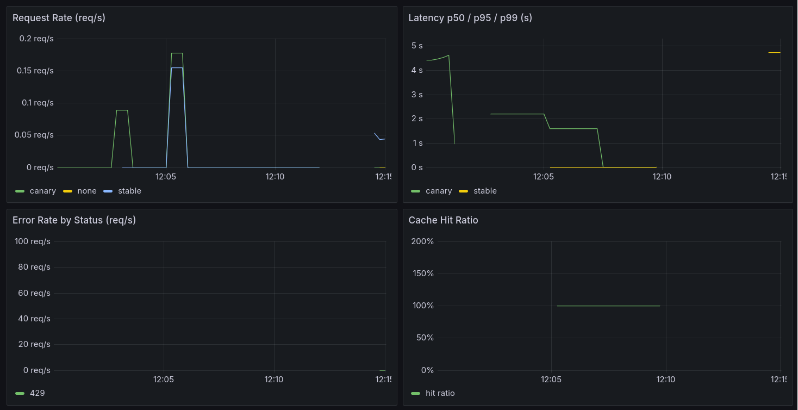

# DomainBot — Production LLMOps Platform

> Fine-tune → gate → serve → deploy → observe → retrain.
> A complete LLM lifecycle on Kubernetes with CI/CD, caching, A/B rollout,
> observability, and automated retraining.

**Status:** 🚧 Day 8/10 — observability (Prometheus metrics + Grafana dashboards + alerts)
**Dataset:** [`Open-Orca/OpenOrca`](https://huggingface.co/datasets/Open-Orca/OpenOrca) — ~4.2M GPT-3.5/GPT-4 instruction pairs over FLAN prompts (MIT)

---

## Architecture

_(diagram lands Day 5)_

```
OpenOrca (stream) → quality filters → PII scrub → dedup → chat format → train/val/test
                          ↓                                                    ↓
                  curation_report.json                            (Day 2: QLoRA fine-tune)
```

## Quickstart

```bash
make setup                      # deps + hooks + spaCy model
make data                       # dvc repro — streams OpenOrca and builds the dataset
SOURCE_MODE=sample make data    # offline: use the bundled sample, no network needed
make test
```

## Why OpenOrca

It is **machine-generated at scale**, which makes it a realistic curation exercise:
refusals, truncated completions, question echoes, repetition loops and template
artifacts all appear in the raw stream. That is the point — the filtering work here
is the same work you'd do on production logs.

Its `id` prefixes (`flan.`, `t0.`, `niv.`, `cot.`) are the FLAN submixes, which we
use as **stratification categories** so every split contains every task family.

## Results (sample mode, 24 rows)

| Metric | Value |
|---|---|
| Raw rows ingested | 24 |
| After curation | 13 (**54% survival**) |
| Removed | refusal 1 · truncated 1 · question-echo 1 · repetition 2 · all-caps 1 · non-English 1 · length 2 · exact-dup 2 |
| PII scrubbed | 1 record (EMAIL, CARD, IP) |
| Chat examples built | 17 (13 curated + 4 honesty) |
| Train / val / test | 7 / 5 / 5 |
| Golden set (frozen) | 22 cases |

> Run against real OpenOrca (`max_docs: 5000`) and expect a different mix —
> read `data/interim/curation_report.json` and tune thresholds from it, not by guessing.

## Dataset design notes

- **Chat format** (`system`/`user`/`assistant`) so TRL's `SFTTrainer` applies the
  model's own chat template — the same template must be applied at inference (Day 4).
- **One standardized system prompt**, not OpenOrca's dozens (ADR-005): a product has
  one persona, and Day 4 injects it server-side so clients cannot override it.
- **Honesty examples** teach the model to say "I don't know". OpenOrca trains it to
  always answer; without a counterweight a fine-tune confidently invents facts.
- **Golden set is frozen** — never trained on, never edited to make a model pass,
  only ever grows as production bugs are found.

## Docs

- [Decisions (ADRs)](DECISIONS.md) — why each tool was chosen, and the tradeoffs
- [Incidents](INCIDENTS.md) — failures, root causes, preventions
- [Runbook](RUNBOOK.md) · [Costs](COSTS.md) · [Day 1 notes](docs/theory-day1.md)
- [COMMANDS.txt](COMMANDS.txt) — every command for Day 1, in order


---

## Day 2 — QLoRA fine-tuning + MLflow

Fine-tune `Qwen2.5-0.5B-Instruct` on the Day 1 dataset using **QLoRA** (4-bit NF4
base + LoRA adapters, ~1-3% of params trainable), tracked in **MLflow**.

- `configs/train.yaml` — every hyperparameter; run experiments by editing this, not code
- `src/training/train.py` — 4-bit load → LoRA → SFT → early stopping → save adapter + sample generations → log to MLflow with **data-version + git-SHA lineage**
- `src/training/compare_runs.py` — comparison table across runs

Run (on a GPU box):
```bash
make train-setup
MLFLOW_TRACKING_URI=file:outputs/mlruns python -m src.training.train --run-name baseline
make mlflow-ui        # http://localhost:5000
```

**Three deliberate experiments** (simulating future retrains): baseline · more epochs +
lower LR · higher LoRA rank. Winner chosen by eval_loss **and** a read of
`sample_generations.json` — eval_loss alone never tells you if answers are actually good.

| Run | eval_loss | notes |
|---|---|---|
| baseline | _fill in_ | |
| more_epochs | _fill in_ | |
| rank32 | _fill in_ | |

> Compute dtype is auto-detected: **bf16** on Ampere+ (RTX 30xx/A100), **fp16** on T4.
> Hardcoding it is the #1 QLoRA portability crash (INC-008).


## Day 3 — Evaluation, quality gate, regression suite, registry

The heart of production ML: a gate that can **block a bad model from shipping**.

- `src/evaluation/evaluate.py` — pure scoring logic (GPU-free, unit-tested): each golden case
  passes iff a `must_contain` pattern matches AND no `must_not_contain` pattern does. The
  `must_not_contain` bans make it a **regression suite** — every past hallucination stays banned.
- `src/evaluation/gate.py` — loads the model, runs all golden cases, applies the gate, and
  **exits non-zero if blocked** (so CI / the retrain pipeline halts). Three conditions, all required:
  1. absolute floor (≥80% pass)
  2. ≥ the currently-deployed model (no regressions)
  3. no per-category collapse (averages hide slice failures)
- `src/evaluation/register.py` — re-runs the gate, then tags the HF repo `v1.0.0` and updates
  the model card. Refuses to register an unapproved model.

```bash
make gate-test                         # prove the gate BLOCKS (10 tests, no GPU)
make gate                              # run it against your model (GPU)
make register VERSION=v1.0.0           # register only if it passed
```

> **The gate caught a real bug.** The Day 2 PII over-scrubbing (INC-013) means the model emits
> `<LOCATION>` placeholders on some fact questions — so the gate blocks those cases. That is the
> gate doing its job: a defect found mechanically, not by luck. Fix = correct the data, retrain,
> re-gate. The golden set is never edited to force a pass.


## Day 4 — Serving: vLLM + FastAPI gateway + Docker

The registered `v1.0.0` model becomes a production API. Two processes: an OpenAI-compatible
**inference engine** (vLLM on GPU, or llama.cpp on CPU) behind a thin **FastAPI gateway** that
owns everything that is policy rather than inference.

```
[client] → [FastAPI gateway :8000] → [vLLM / llama.cpp engine :8001]
             auth · limits · system-prompt · health · errors      inference
```

- `src/serving/app.py` — the gateway: Pydantic validation, **server-side system prompt**,
  prompt-injection defense (**client `role: system` is rejected**), SSE streaming, API-key auth,
  `/healthz` (liveness) vs `/readyz` (readiness — pings the engine), `/v1/model-info` (verify
  rollouts), and error mapping (timeout→504, engine down→503, engine error→502).
- `src/serving/schemas.py` — request/response models; the validation *is* the security boundary.
- `Dockerfile` — multi-stage, slim, **non-root**, `HEALTHCHECK`; **no weights baked in**.

```bash
make serve-test                        # 10 gateway tests, no GPU
vllm serve vinmlops/domainbot-1.5b-rank32 --revision v1.0.0 --served-model-name domainbot --port 8001
make serve                             # gateway on :8000
```

**Two design decisions carry the day:**
- **Gateway in front of the engine (ADR-012)** — the engine does inference; it doesn't know your
  auth, limits, persona, or health semantics. Keeping those in a thin gateway makes the engine
  swappable (vLLM ↔ llama.cpp) with zero client changes.
- **Pull weights at a pinned revision, never bake them (ADR-013)** — the image stays tiny (code
  only), and the model version is switchable by one env var (`DOMAINBOT_REVISION`) with no rebuild
  — the basis for Day 5 rollback. "Same tag, new weights" is a silent prod killer, so pin.

> The **server-side system prompt + `apply_chat_template`** here is the same one used in training
> (Day 2) — inference must mirror training. And a client cannot override it: `role: system` from a
> client is rejected (422), closing a prompt-injection vector.

## Day 5 — Kubernetes (gateway-only) → external model endpoint

The model runs on an **external cloud platform**; we have only its API endpoint. Kubernetes runs
**only the FastAPI gateway**, which calls out to that endpoint and returns responses to users.
No GPU, no engine, in our cluster — a common, cost-effective production pattern (managed inference).

```
[user] → [K8s: FastAPI gateway] ──HTTP──▶ [external cloud model endpoint /v1]
              probes · auth · limits            (managed vLLM — we just call it)
```

- **Gateway-only in K8s (ADR-016)** — the platform owns GPU scheduling, weights, and engine
  scaling; we own auth, validation, the system prompt, limits, health, and logging. The gateway
  forwards an optional Bearer token upstream, so it works with managed APIs that require auth.
- **Probes** — `livenessProbe → /healthz` (process; fail = restart); `readinessProbe → /readyz`
  (pings the **external endpoint**; fail = stop routing traffic, no restart). If the endpoint is
  down, pods go NotReady but aren't restarted — correct handling of an upstream outage.
- **HPA** autoscales the (CPU-only) gateway 2→10 on load. **PDB** keeps ≥1 during disruptions.
- **Rollback** — `rollout undo` for gateway code; a ConfigMap change for the reported model version.

```bash
make k8s-validate                                  # 9 manifest tests, no cluster
kubectl -n domainbot create secret generic domainbot-secrets \
  --from-literal=DOMAINBOT_ENGINE_URL="https://your-endpoint/v1" \
  --from-literal=DOMAINBOT_API_KEY="$(openssl rand -hex 16)" --dry-run=client -o yaml | kubectl apply -f -
kubectl apply -k k8s/                              # deploy the gateway
kubectl -n domainbot port-forward svc/domainbot-gateway 8000:8000
```

> **The endpoint URL lives in a Secret, never in Git.** Swap `DOMAINBOT_ENGINE_URL` to move
> between providers (or later to an in-cluster engine) with zero code change — the same
> engine-swappable design from Day 4. This gateway-to-external-endpoint architecture is the
> standing setup for Days 6–10.

## Day 6 — CI/CD: GitHub Actions + Argo CD (GitOps) + Terraform + Helm

Every push to main is tested, built, and rolled out automatically. Deploy = merge;
rollback = `git revert`. The gateway ships through the pipeline; the model stays external.

```
push to main → CI: lint → test → build+push image(git-<sha>) → bump kustomization.yaml
                                                                       ↓ (git commit)
                                              Argo CD (in-cluster) detects → syncs cluster
```

- **CI (`.github/workflows/ci.yaml`)** — lint (ruff) + pytest + validate k8s manifests, then
  build and push `ghcr.io/.../domainbot-gateway:git-<sha>`. **Tests gate the build**
  (`build-push needs: test`) — untested code can never ship (ADR-017).
- **GitOps (Argo CD, `argocd/application.yaml`)** — the cluster *pulls* desired state from Git.
  CI writes the new image tag into `k8s/kustomization.yaml`; Argo detects the commit and syncs.
  `selfHeal` reverts manual drift; `prune` removes deleted resources. Rollback = `git revert`
  (ADR-018). No CI system holds cluster credentials.
- **Terraform (`terraform/`)** — declaratively provisions the namespace + secrets (and, in a cloud
  setup, the cluster itself). Infra layer, separate from app deploy (ADR-019).
- **Helm (`helm/domainbot/`)** — values-based packaging as an alternative to Kustomize, for
  per-environment overrides.

```bash
make cicd-test                         # 8 config tests, no pipeline run
# install Argo CD, then:
kubectl apply -f argocd/application.yaml
git push                               # → CI builds → Argo deploys
```

> **Deploy and rollback are ordinary Git operations** — auditable, reviewable, revertible. The
> cluster state always equals what's in Git. This pipeline carries only the gateway; the model
> endpoint is managed externally (Day 5 architecture), so retrains publish to the Hub and the
> gateway just points at the new revision.

## Day 7 — Redis caching + rate limiting + A/B (canary) routing

A caching and control layer in front of the gateway. Same external-endpoint architecture;
now identical prompts are cached, clients are rate-limited, and new model versions can be
canaried on real traffic.

```
[user] → [gateway: cache? · rate-limit? · route A/B] → [external model endpoint]
                       ↕
                    [Redis]
```

- **Response cache (ADR-020)** — Redis, keyed by system prompt + messages + params + **model
  revision**. Only caches **deterministic** (temperature 0) requests — identical input → identical
  output, so a hit is correct by construction. A cache hit is ~1ms vs hundreds upstream, and cuts
  the paid endpoint's bill. Fails **open**: Redis down → serve normally (a cache is never a hard dep).
- **Rate limiting (ADR-021)** — fixed-window per-client quota in Redis; 429 when exceeded. Protects
  the shared upstream budget from one noisy client. Also fails open.
- **A/B canary routing (ADR-021)** — split a fraction of traffic to a new model version, with
  **sticky per-client** assignment (a user stays on one variant during a rollout). Ramp
  0→20→100 via one env var; roll back instantly by setting it to 0.

```bash
make cache-test                        # 11 logic tests, no Redis
make redis-local                       # local Redis
# then run the gateway with DOMAINBOT_REDIS_URL set and watch cache hits
```

> **All three controls are Redis-backed and fail-open.** The cache and rate limiter make the
> gateway cheaper and safer without becoming a new single point of failure — if Redis dies, the
> gateway degrades to "no cache, no limit" and keeps serving. Canary routing turns a model
> upgrade into a gradual, instantly-reversible rollout instead of a risky big-bang switch.

## Day 8 — Observability: Prometheus metrics + Grafana + alerts

You can't improve what you can't see. Day 7 added caching, rate limiting, and canary routing;
Day 8 makes them **measurable** — turning "I think the cache helps" into "cache hit ratio hit 100%
on repeated prompts and p95 latency dropped from ~4.5s to near-zero."

```
[gateway /metrics] ──scrape──▶ [Prometheus] ──query──▶ [Grafana dashboards]
                                     └──▶ alert rules (SLO breaches)
```

- **Metrics (`src/serving/metrics.py`, ADR-022)** — the **four golden signals** (latency, traffic,
  errors, saturation) plus cache hit ratio, rate-limit rejections, tokens, and upstream health.
  Everything is labeled by **variant (stable|canary)** so the canary is compared to stable directly.
  Latency is a **histogram** (→ p50/p95/p99) — averages hide the tail; percentiles are what users feel.
- **Prometheus** — scrapes each gateway pod's `/metrics` every 15s (pod discovery via RBAC).
- **Grafana** — a pre-provisioned dashboard: request rate, p95 latency, error rate by status,
  **cache hit ratio**, rate-limited/s, tokens/s, upstream up, upstream errors — all per variant.
- **Alerts** — documented SLOs: >5% errors, p95>3s, upstream down, canary errors >10% (→ rollback).

```bash
make metrics-test                      # 4 tests, no cluster
kubectl apply -k k8s/observability/    # Prometheus + Grafana + alerts
make grafana                           # open the dashboard
```

### The dashboard (live traffic across stable + canary)



The four golden signals, split by variant. Three things worth reading off this panel:

- **Request Rate** shows *both* `stable` (blue) and `canary` (green) receiving traffic — the 50/50
  split routing correctly, with `none` (yellow) marking pre-routing rejections (rate-limited requests).
- **Latency (p95)** shows the **cache effect as a cliff**: requests start at ~4.5s (real upstream calls),
  then drop to **near-zero** the moment identical prompts start hitting cache. That vertical fall *is*
  the cache doing its job, made visible.
- **Cache Hit Ratio** climbs to **100%** during the repeated-prompt window — every request served from
  Redis, zero upstream cost. This is the Day 7 optimization proven with a production number, not a
  one-off `curl` timing.
- **Error Rate** stays flat at zero — no failures under load.


The control-plane and health panels:

- **Rate-Limited (429/s)** spikes exactly when a single client bursts past its per-minute quota —
  the limiter protecting the shared upstream budget, caught on the graph.
- **Tokens/s by Variant** tracks prompt vs completion tokens for *both* stable and canary — the basis
  for cost attribution and capacity planning, per model version.
- **Upstream Up** holds flat at `1` — the external endpoint stayed reachable throughout.
- **Upstream Errors** reads **"No data"** — which is the *healthy* state: no timeouts, no connection
  failures, nothing to plot.

> **This is what makes the canary safe.** With per-variant latency and error panels, you *see* the
> canary's health next to stable and decide to ramp or roll back on data, not vibes. The cache-hit
> and latency panels turn Day 7's work into evidence: a measured **100% hit ratio** and a visible
> **latency collapse** from seconds to milliseconds. Metrics are the difference between "I think it
> works" and "here is the graph."

## What I'd do differently at 100× scale

_(written Day 10)_

## Tech stack

`Python` `HF datasets (streaming)` `DVC` `Presidio` `langdetect` `pydantic` `pytest` `ruff` `pre-commit`
_(growing daily: PEFT/QLoRA, MLflow, vLLM, FastAPI, Docker, Kubernetes, Helm, Argo CD,
Terraform, Redis, Prometheus, Grafana)_
